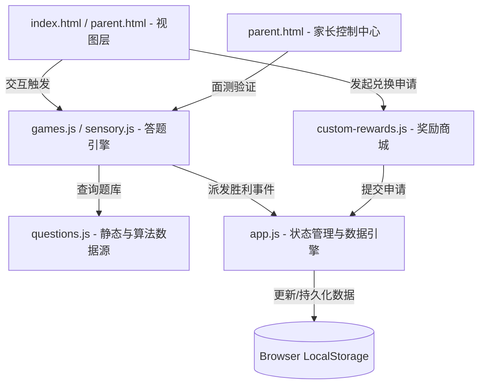

# 🧠 脑力认知研究所 · 架构与积分奖励系统设计说明书

本说明书详述了“脑力认知研究所”的系统解耦架构、独立的积分与奖励机制框架（LRPF），以及针对“题目重复问题”的算法化题库演进方案。旨在为后续的迭代开发提供清晰的模块划分与指导。

---

## 🗺️ 一、 系统解耦架构蓝图 (Architecture Blueprint)

系统采用纯前端“单页应用 (SPA)”的轻量化解耦设计，确保数据流向单一、模块职责清晰：



### 1. 核心模块分工
* **数据持久层 (`app.js`)**：负责统一的状态读写（`appState`），封装 `saveAppState()` 和 `initAppState()`，不掺杂任何 UI 渲染或题目判断逻辑。
* **数据存储源 (`questions.js`)**：存放静态题目数组与部分动态生成函数（如 `getDynamicNumeric`）。作为纯粹的数据集，不包含任何答题状态。
* **答题控制引擎 (`games.js` / `sensory.js`)**：负责关卡的生命周期（载入、音频播放、事件监听、判断正误）。
* **奖励与兑换中心 (`custom-rewards.js`)**：负责商城 UI 的渲染，玩家自主发起兑换申请（Redemption），并将申请推送到状态引擎的队列中。
* **家长控制基地 (`parent.html` & scripts)**：提供进度解密备份、奖励审核确认，以及高阶**“现场面测验证”**接口。

---

## 🪙 二、 独立积分与奖励机制设计 (LRPF)

为了防止积分与题目强耦合导致系统难以拓展，我们设计了**“逻辑特训独立积分与奖励框架”（Logic Reward & Points Framework, LRPF）**。

### 1. 统一状态 Schema
所有的积分、勋章、进度和兑换流程均由以下独立的数据结构描述，并以 JSON 格式存储在 `localStorage` 中：

```json
{
  "lastUpdated": 1717112000000,
  "players": {
    "dabao": {
      "name": "果果 (6岁)",
      "avatar": "🦁",
      "stars": 120,
      "progress": { "spatial": 5, "numeric": 8, "attention": 12, "mixed": 15 },
      "medals": ["spatial_rookie"]
    },
    "erbao": {
      "name": "淼淼 (2岁)",
      "avatar": "🐰",
      "stars": 30,
      "stickers": ["happy_bunny"]
    }
  },
  "rewards": [
    { "id": "r1", "title": "看动画片 30 分钟 📺", "cost": 180, "target": "dabao" },
    { "id": "r2", "title": "去楼下坐摇摇车 2 次 🎠", "cost": 90, "target": "erbao" }
  ],
  "redemptions": [
    {
      "playerId": "dabao",
      "playerName": "果果 (6岁)",
      "rewardTitle": "看动画片 30 分钟 📺",
      "cost": 180,
      "date": "2026-05-31 07:15"
    }
  ]
}
```

### 2. 积分与奖励接口定义 (API Hooks)
系统提供以下全局 API，任何子游戏模块均可无缝调用以增减金币：

* **金币与胜利分发器**：`trigger6yoVictory(starEarned, speechFeedback)`
  * *职责*：增加金币 ➔ 写入 LocalStorage ➔ 刷新屏幕 HUD 显示 ➔ 语音赞赏 ➔ 自动切换下一关。
* **奖励兑换申请**：`requestRedemption(playerId, rewardId)`
  * *职责*：核对余额是否足够 ➔ 扣除虚拟金币 ➔ 将申请推入 `redemptions` 审核队列 ➔ 触发页面渲染。
* **家长端确认发放**：`approveRedemption(index)`
  * *职责*：扣除最终积分 ➔ 从 `redemptions` 队列移除该申请 ➔ 提示家长进行线下物理奖励发放。

---

## 🔄 三、 题目重复问题诊断与算法化演进方案

### 1. 重复问题的根源分析
目前的关卡调度逻辑是：
```javascript
const phase = ((level - 1) % 5) + 1; // 5种题型轮流穿插
const qIdx = Math.floor((level - 1) / 5); // 每种题型的索引
```
由于每个维度总共有 50 关，每种题型会循环执行 10 次。因此 `questions.js` 中的静态数组（如 `MIRROR_QUESTIONS`）长度为 10，当关卡推进到 50 关时，孩子其实会**把相同的 10 道题目重新做一遍（虽然打乱了选项顺序）**。

### 2. 算法化生成（Procedural Generation, PCG）演进路线
为了彻底消除重复，让孩子拥有“无限不重复”的答题体验，建议将所有题库的**静态数组逐步升级为“算法动态生成器”**，如同目前的 `getDynamicNumeric` 和 `getDynamicAttention`。

#### 📐 改造示范 1：空间图形推理 (镜像与旋转题算法化)
不再存储固定的 `⬛⬜⬜` 字符串，而是使用算法随机生成一个对角对称的 3x3 矩阵，再动态计算其镜像矩阵：

```javascript
// 动态生成一个不重复的 3x3 图形矩阵并计算镜像
function generateDynamicMirror(level) {
  const elements = ['🔴', '🔵', '🟡', '⬜'];
  let original = [];
  
  // 随机生成 3x3 的前半部分，保证难度随关卡 (level) 递增
  for (let i = 0; i < 3; i++) {
    let row = [];
    for (let j = 0; j < 3; j++) {
      row.push(elements[Math.floor(Math.random() * (level > 25 ? 4 : 3))]);
    }
    original.push(row);
  }
  
  // 算法生成镜像：每一行左右对调
  let correct = original.map(row => [...row].reverse());
  
  // 算法生成干扰项：上下颠倒、颜色微调等
  let wrong1 = [...original].reverse(); 
  let wrong2 = original.map(row => row.map(cell => cell === '🔴' ? '🔵' : cell));
  
  return {
    original: original.map(r => r.join('')).join('\n'),
    correct: correct.map(r => r.join('')).join('\n'),
    wrong: [
      wrong1.map(r => r.join('')).join('\n'),
      wrong2.map(r => r.join('')).join('\n')
    ],
    hint: "照镜子时，左手边的红色球会跑到右手边哦！"
  };
}
```

#### ⚖️ 改造示范 2：天平代换推理算法化
数字天平可以使用三元联立一次方程的代换算法，在题目加载时实时改变“水果种类”和“代换系数”，确保每次做题数据完全不同：

```javascript
function generateDynamicWeight(level) {
  const items = ['🍉西瓜', '🍎苹果', '🍒樱桃', '🍌香蕉', '🍓草莓'];
  items.sort(() => Math.random() - 0.5); // 随机打乱物品名称
  
  // 根据关卡动态计算代换常数
  const factorA = Math.floor(Math.random() * 2) + 2; // 2 或 3
  const factorB = Math.floor(Math.random() * 2) + 3; // 3 或 4
  
  return {
    text: `【高阶代换】请根据天平代换关系，把物品【从最重到最轻】排列好：`,
    clues: [
      `⚖️ 天平一：1个 ${items[0]} = ${factorA} 个 ${items[1]}`,
      `⚖️ 天平二：1个 ${items[1]} = ${factorB} 个 ${items[2]}`
    ],
    items: [
      { id: '1', text: `${items[0]} (最重)` },
      { id: '2', text: `${items[1]} (中等)` },
      { id: '3', text: `${items[2]} (最轻)` }
    ],
    hint: `1个${items[0]}可以换成多个${items[1]}，所以${items[0]}分量最足！`
  };
}
```

### 3. 演进路线图结论
通过上述**“算法生成模板”**去逐步替换 `questions.js` 中的静态数组，可以用极少的代码量，膨胀出**数万道100%不重复的全新脑力挑战题**。这不仅能完美支持 50 关，甚至能支撑起 400 关的长期综合航线特训，完美契合北京八中超常儿童选拔的“高频认知刺激”理念。
