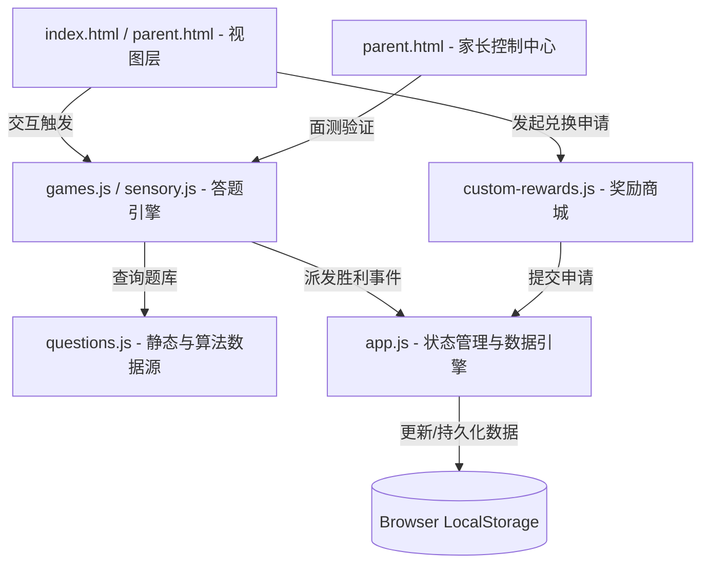

# 🧠 脑力认知研究所 · 架构与积分奖励系统设计说明书

本说明书详述了“脑力认知研究所”的系统解耦架构、独立的积分与奖励机制框架（LRPF），以及针对“题目重复问题”的算法化题库演进方案。旨在为后续的迭代开发提供清晰的模块划分与指导。

---

## 🗺️ 一、 系统解耦架构蓝图 (Architecture Blueprint)

系统采用纯前端“单页应用 (SPA)”的轻量化解耦设计，确保数据流向单一、模块职责清晰：



### 1. 核心模块分工
* **数据持久层 (`app.js`)**：负责统一的状态读写（`appState`），封装 `saveAppState()` 和 `initAppState()`，不掺杂任何 UI 渲染或题目判断逻辑。
* **数据存储源 (`questions.js`)**：存放静态题目数组与部分动态生成函数（如 `getDynamicNumeric`）。作为纯粹的数据集，不包含任何答题状态。
* **答题控制引擎 (`games.js` / `sensory.js`)**：负责关卡的生命周期（载入、音频播放、事件监听、判断正误）。
* **奖励与兑换中心 (`custom-rewards.js`)**：负责商城 UI 的渲染，玩家自主发起兑换申请（Redemption），并将申请推送到状态引擎的队列中。
* **家长控制基地 (`parent.html` & scripts)**：提供进度解密备份、奖励审核确认，以及高阶**“现场面测验证”**接口。

---

## 🪙 二、 独立积分与奖励机制设计 (LRPF)

为了防止积分与题目强耦合导致系统难以拓展，我们设计了**“逻辑特训独立积分与奖励框架”（Logic Reward & Points Framework, LRPF）**。

### 1. 统一状态 Schema
所有的积分、勋章、进度和兑换流程均由以下独立的数据结构描述，并以 JSON 格式存储在 `localStorage` 中：

```json
{
  "lastUpdated": 1717112000000,
  "players": {
    "dabao": {
      "name": "果果 (6岁)",
      "avatar": "🦁",
      "stars": 120,
      "progress": { "spatial": 5, "numeric": 8, "attention": 12, "mixed": 15 },
      "medals": ["spatial_rookie"]
    },
    "erbao": {
      "name": "淼淼 (2岁)",
      "avatar": "🐰",
      "stars": 30,
      "stickers": ["happy_bunny"]
    }
  },
  "rewards": [
    { "id": "r1", "title": "看动画片 30 分钟 📺", "cost": 180, "target": "dabao" },
    { "id": "r2", "title": "去楼下坐摇摇车 2 次 🎠", "cost": 90, "target": "erbao" }
  ],
  "redemptions": [
    {
      "playerId": "dabao",
      "playerName": "果果 (6岁)",
      "rewardTitle": "看动画片 30 分钟 📺",
      "cost": 180,
      "date": "2026-05-31 07:15"
    }
  ]
}
```

### 2. 积分与奖励接口定义 (API Hooks)
系统提供以下全局 API，任何子游戏模块均可无缝调用以增减金币：

* **金币与胜利分发器**：`trigger6yoVictory(starEarned, speechFeedback)`
  * *职责*：增加金币 ➔ 写入 LocalStorage ➔ 刷新屏幕 HUD 显示 ➔ 语音赞赏 ➔ 自动切换下一关。
* **奖励兑换申请**：`requestRedemption(playerId, rewardId)`
  * *职责*：核对余额是否足够 ➔ 扣除虚拟金币 ➔ 将申请推入 `redemptions` 审核队列 ➔ 触发页面渲染。
* **家长端确认发放**：`approveRedemption(index)`
  * *职责*：扣除最终积分 ➔ 从 `redemptions` 队列移除该申请 ➔ 提示家长进行线下物理奖励发放。

---

## 🔄 三、 题目重复问题诊断与算法化演进方案

### 1. 重复问题的根源分析
目前的关卡调度逻辑是：
```javascript
const phase = ((level - 1) % 5) + 1; // 5种题型轮流穿插
const qIdx = Math.floor((level - 1) / 5); // 每种题型的索引
```
由于每个维度总共有 50 关，每种题型会循环执行 10 次。因此 `questions.js` 中的静态数组（如 `MIRROR_QUESTIONS`）长度为 10，当关卡推进到 50 关时，孩子其实会**把相同的 10 道题目重新做一遍（虽然打乱了选项顺序）**。

### 2. 算法化生成（Procedural Generation, PCG）演进路线
为了彻底消除重复，让孩子拥有“无限不重复”的答题体验，建议将所有题库的**静态数组逐步升级为“算法动态生成器”**，如同目前的 `getDynamicNumeric` 和 `getDynamicAttention`。

#### 📐 改造示范 1：空间图形推理 (镜像与旋转题算法化)
不再存储固定的 `⬛⬜⬜` 字符串，而是使用算法随机生成一个对角对称的 3x3 矩阵，再动态计算其镜像矩阵：

```javascript
// 动态生成一个不重复的 3x3 图形矩阵并计算镜像
function generateDynamicMirror(level) {
  const elements = ['🔴', '🔵', '🟡', '⬜'];
  let original = [];
  
  // 随机生成 3x3 的前半部分，保证难度随关卡 (level) 递增
  for (let i = 0; i < 3; i++) {
    let row = [];
    for (let j = 0; j < 3; j++) {
      row.push(elements[Math.floor(Math.random() * (level > 25 ? 4 : 3))]);
    }
    original.push(row);
  }
  
  // 算法生成镜像：每一行左右对调
  let correct = original.map(row => [...row].reverse());
  
  // 算法生成干扰项：上下颠倒、颜色微调等
  let wrong1 = [...original].reverse(); 
  let wrong2 = original.map(row => row.map(cell => cell === '🔴' ? '🔵' : cell));
  
  return {
    original: original.map(r => r.join('')).join('\n'),
    correct: correct.map(r => r.join('')).join('\n'),
    wrong: [
      wrong1.map(r => r.join('')).join('\n'),
      wrong2.map(r => r.join('')).join('\n')
    ],
    hint: "照镜子时，左手边的红色球会跑到右手边哦！"
  };
}
```

#### ⚖️ 改造示范 2：天平代换推理算法化
数字天平可以使用三元联立一次方程的代换算法，在题目加载时实时改变“水果种类”和“代换系数”，确保每次做题数据完全不同：

```javascript
function generateDynamicWeight(level) {
  const items = ['🍉西瓜', '🍎苹果', '🍒樱桃', '🍌香蕉', '🍓草莓'];
  items.sort(() => Math.random() - 0.5); // 随机打乱物品名称
  
  // 根据关卡动态计算代换常数
  const factorA = Math.floor(Math.random() * 2) + 2; // 2 或 3
  const factorB = Math.floor(Math.random() * 2) + 3; // 3 或 4
  
  return {
    text: `【高阶代换】请根据天平代换关系，把物品【从最重到最轻】排列好：`,
    clues: [
      `⚖️ 天平一：1个 ${items[0]} = ${factorA} 个 ${items[1]}`,
      `⚖️ 天平二：1个 ${items[1]} = ${factorB} 个 ${items[2]}`
    ],
    items: [
      { id: '1', text: `${items[0]} (最重)` },
      { id: '2', text: `${items[1]} (中等)` },
      { id: '3', text: `${items[2]} (最轻)` }
    ],
    hint: `1个${items[0]}可以换成多个${items[1]}，所以${items[0]}分量最足！`
  };
}
```

### 3. 演进路线图结论
通过上述**“算法生成模板”**去逐步替换 `questions.js` 中的静态数组，可以用极少的代码量，膨胀出**数万道100%不重复的全新脑力挑战题**。这不仅能完美支持 50 关，甚至能支撑起 400 关的长期综合航线特训，完美契合北京八中超常儿童选拔的“高频认知刺激”理念。

---

## 📱 四、 iPad 移动端触屏适配规范 (Touch Drag-and-Drop & Tap-to-Move Standards)

为了保证游戏在 iPad 等主流平板设备的移动端触屏上能够拥有原生 App 级别的交互手感，我们制定了以下双重交互标准和底层适配规范：

### 1. 为什么禁用 HTML5 `draggable="true"` 规范？
在 WebKit（iOS / iPad OS Safari 与 Chrome）移动端渲染中，若对元素设置 `draggable="true"` 属性并使用 HTML5 原生 drag 事件，系统长按时会直接触发系统的 ghost 图片剪切和文本选择机制，直接劫持并终止 `touchstart` 和 `touchmove` 事件流，导致拖拽彻底失效或出现剧烈延迟卡顿。

### 2. 统一指针事件（Pointer Events）拖拽架构
系统全面切换为统一的 Pointer Events API，支持用一套极简代码无缝驱动 Desktop 鼠标和 iPad 手指操作：
* **指针捕获机制 (`Pointer Capture`)**：在 `pointerdown` 事件中，执行 `element.setPointerCapture(e.pointerId)`，将当前指触焦点强行绑定在该拖拽项上。即使孩子手指滑动过快偏离了卡片，依然能够稳定跟随，不会产生脱靶现象。
* **GPU 满帧渲染 (`translate3d`)**：拖拽位移一律采用 GPU 硬件加速的 `transform: translate3d(dx, dy, 0)` 渲染，消除像素抖动，保证拖拽延迟低于 16ms（60FPS 满帧运行）。
* **绝对坐标槽位探测 (`elementFromPoint`)**：在 `pointerup` (或 pointercancel) 阶段，由于卡片本身在手指下方，我们需要：
  1. 临时设置被拖拽元素的 `style.pointerEvents = 'none'`；
  2. 调用 `document.elementFromPoint(e.clientX, e.clientY)` 获取松手时手指坐标正下方的 DOM 元素；
  3. 恢复 `pointerEvents = ''`；
  4. 利用 `closest('.shape-slot')` 或 `closest('.deduction-slot')` 精准匹配并派发放置逻辑。
* **手势防划隔离 (`touch-action: none`)**：所有可拖拽的卡片、小球、形状积木，其内联样式中**必须设置 `touch-action: none;` 和 `user-select: none;`**。这能从 CSS 级底层告知 iPad OS 视口：手指在该积木上划动时，严禁触发页面的滚动（Rubber-banding）和双击缩放，实现绝对稳定的单卡片位移。

### 3. 极速备选点击 (Tap-to-Move) 辅助交互
考虑到小年龄段孩子（如 2 岁淼淼）在 iPad 上的精细动作能力尚未发育完全，系统必须支持**“拖拽”与“轻点飞入”**双重容错交互：
* **距离微小点击过滤**：在 `pointerup` 时，计算 `Math.sqrt(dx*dx + dy*dy)`。如果指针位移小于 `6px`，则被过滤为“快速轻点/Tap”手势，立即触发槽位飞入/撤回函数，并跳过 drag-and-drop 的物理坐标探测。
* **智能飞入**：轻点备选池卡片，卡片瞬间飞入上方首个空置步骤槽；轻点槽内卡片，卡片瞬间撤回下方备选池，提供 100% 极简答题通道。

---

## 🎬 五、 3D 空间变换“动画演示课”脚手架 (Visual Scaffolding Engine)

针对“镜像对称”、“图形旋转”这类高认知负荷的空间想象力题目，系统配备了**“3D动画演示教学助手”**，旨在在孩子思考遇到死角时提供最形象的视觉支架（Scaffolding）：

### 1. 3D 折叠镜像动画规范
* **动画触发**：用户点击 `🎬 观看动画演示` 按钮，弹出 `backdrop-filter: blur(12px)` 的玻璃磨砂全屏浮层。
* **物理翻飞**：原图卡片使用 `@keyframes` 运行，运用 3D 透视视口（`perspective: 600px`），执行 **`transform: rotateY(180deg)` 的 3D 沿镜轴左右翻转动画** 并向镜面侧移动，以 3D 翻动极具动感地演示了什么叫“左右互换”与“轴对称”。
* **双通道融合 (Speech + Visual)**：播放动画的同时，调用 SpeechUtterance 中文语音合成播放教学引导，达成“视觉 + 听觉”双重编码学习，帮助孩子跨越认知负荷障碍。

### 2. 罗盘顺时针旋转动画规范
* **动画触发**：在弹窗中央展现原图，并在其背景渲染罗盘轨迹。
* **时针偏转**：卡片在 `3.5s` 的循环周期内，以自身中心为原点，极其流畅地**顺时针向右偏转 90° 或 180°**，悬停 1.5s 后重播。
* **角度解析**：演示引擎自动嗅探题目中的 `title` 和 `hint`。如果包含 "180" 或 "半圈" 字眼，则加载 `rotate180Anim` 翻转动画；若为 "90"，则加载 `rotate90Anim` 四分之一圈偏转动画，与题干完全对齐。

---

## 🔒 六、 视图滚动锁定与防冲突手势规范 (Gameplay Viewport Locking & Scrollbar Removal)

为了彻底解决 iPad 在手指拖拽时由于“页面弹性滚动”与“滚动条闪烁”导致的手势冲突，系统实施了动态的**“视口状态锁 (Viewport State Lock)”**机制：

### 1. 滚动条冲突原理
移动端 WebKit 在手指滑动时默认拥有回弹（Bounce/Rubber-banding）特性。当孩子手指按压卡片并在屏幕上做拖拽位移时，若视口存在任何滚动可能，浏览器会优先触发 `window` 或 `body` 的视口位移，导致卡片在指尖下断联，手指与拖曳卡片产生错位脱靶。

### 2. 动态滚动锁定架构
为了保持大厅 HUD 面板、商城、家长报告的自然滚动能力，同时在关卡运行中彻底去除滚动条与回弹，系统使用以下动态切换规范：
* **进入游戏锁定**：
  在 `launchTest()`、`launchMixedMode()` 以及早教 `launchSensory()` 入口函数中，强行锁定浏览器视口：
  ```javascript
  document.body.style.overflow = 'hidden';
  document.body.style.position = 'fixed';
  document.body.style.width = '100%';
  document.body.style.height = '100%';
  ```
* **退出游戏复位**：
  在返回大厅 HUD `loadDabaoHUD()`、`loadErbaoHUD()` 以及切换成员 `logoutPlayer()` 出口函数中，完美还原视口滚动：
  ```javascript
  document.body.style.overflow = '';
  document.body.style.position = '';
  document.body.style.width = '';
  document.body.style.height = '';
  ```
通过这种**“非游戏态自由滚动，游戏态绝对锁定”**的按需切合设计，完全去除了页面滚动条的干扰，使得 iPad 上的手指拖曳体验达到 100% 灵敏与纯净。

---

## ⏭️ 七、 特训关卡“容错跳过”机制规范 (Gameplay Step-Over & Skip Level Standard)

为了保护孩子的求知欲，避免极难题目（如 Level 43+ 的超常挑战）对孩子造成挫败感和心流中断，系统引入了**“跳过本关 (Skip Level)”**的弹性认知容错设计：

### 1. 核心运行逻辑
* **全局容器嵌入**：
  在 `launchTest()` 和 `launchMixedMode()` 渲染关卡容器后，系统会统一在底部动态追加一个低对比度、无压力感的轻量化跳过操作条：
  ```html
  <button class="mock-button-skip" onclick="skipCurrent6yoLevel()">⏭️ 跳过这一关</button>
  ```
* **跳过操作流程 (`skipCurrent6yoLevel`)**：
  1. **二次确认保护**：弹出友好确认框，避免误触。提示跳过不会扣除金币，但也不会发放本关奖励。
  2. **状态安全递增**：将对应维度关卡数（特定维度的 `player.progress[type]++` 或综合航线的 `player.progress.mixed++`）向前推进 1 关，并即刻执行 `saveAppState()` 保存数据。
  3. **语音情感缓冲**：调用 SpeechUtterance 接口对孩子说出鼓励语：“这关有点难，没关系！我们先来挑战下一关吧，加油！”
  4. **重载下一关**：自动触发 `launchTest(type)` 或 `launchMixedMode()`，重构下一关卡，确保游戏体验不间断。


