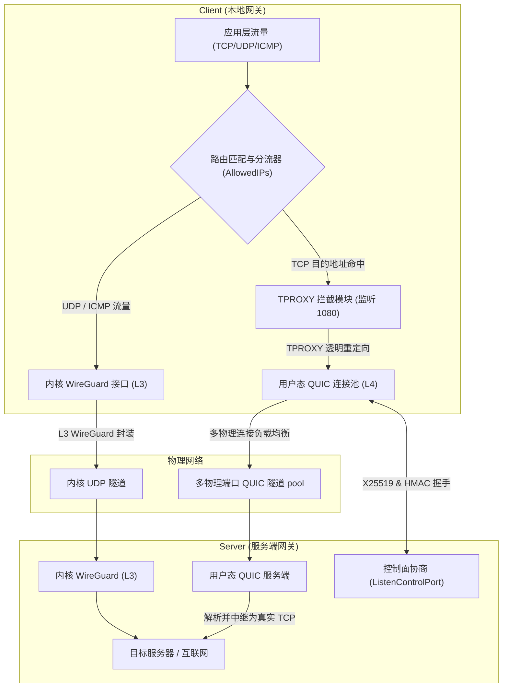
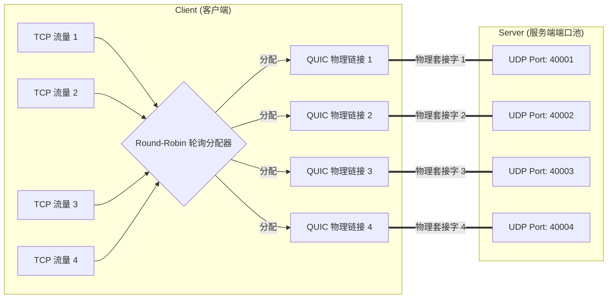

# 突破 TCP-over-VPN 队头阻塞：探索高性能混合安全网关 new_proxy 的架构与设计

在现代安全网络隧道与 VPN 技术中，**内核态的三层（L3）VPN（如 WireGuard）**以其极简的设计、极低的延迟和极佳的吞吐量成为了业界新宠。然而，当物理网络遭遇恶劣的丢包环境，或者面对大规模的 TCP 业务流传输时，传统的 L3 VPN 会遭遇一个经典的技术梦魇——**TCP-over-VPN 队头阻塞（Head-of-Line Blocking）与 TCP 熔断（TCP Meltdown）**。

为了彻底打破这一性能瓶颈，我设计并实现了我的第一个高性能网关项目：`new_proxy`。这是一个**基于 Rust 编写的混合 L3/L4 高性能安全代理网关**。它将系统内核态的 WireGuard 通道与用户态的多路复用 QUIC 连接池进行深度融合，实现了“双轨数据面”的革命性设计。

本文将深入拆解 `new_proxy` 的技术架构、设计原理以及在追求极限性能方面所做的核心优化。

---

## 1. 核心痛点：为什么传统的 TCP-over-VPN 这么慢？

在标准的 WireGuard 或 L3 VPN 隧道中，所有的应用层流量（包括 TCP）都会被封装为原始 IP 报文，再放入底层的 UDP 隧道报文中进行传输：

$$\text{App TCP} \rightarrow \text{IP Tunnel Device} \rightarrow \text{UDP Wrapper} \rightarrow \text{Internet}$$

当物理链路发生**随机丢包**时，这一架构的缺陷就会暴露无遗：
1. **重传冲突与队头阻塞**：底层 UDP 隧道是无状态且不保证递送的。如果一个底层的 UDP 包在网络中丢失，内部封装的 TCP 报文也会随之丢失。此时，内部的 TCP 协议栈会触发超时重传。但在重传完成并按序重组之前，**后续所有到达的 TCP 报文都必须在缓冲区中排队等待**。这就是 TCP 的“队头阻塞”现象。
2. **拥塞控制算法互卷（TCP Meltdown）**：内层的 TCP 拥塞控制算法与外层的网络链路传输特征发生冲突。在恶劣网络下，TCP 会误判带宽并剧烈降低发送窗口，导致整体吞吐量呈断崖式下跌，甚至发生“网络熔断”。

---

## 2. new_proxy 的解法：双轨数据面与 L4 拦截

`new_proxy` 的核心思想是**分流与专道专用**：将无状态、轻量级的 UDP/ICMP 流量留在高效的**内核态 L3 通道**中，而将重状态、易受队头阻塞影响的 TCP 流量剥离出来，透明拦截至**用户态的高性能 QUIC 连接池**中传输。

### 2.1 整体技术架构图

`new_proxy` 通过 Linux **TPROXY (透明代理)** 和**策略路由**，在数据链路上实现了无感知的透明分流。以下是 `new_proxy` 的架构拓扑与流量分发原理图：



### 2.2 核心运作流程

1. **路由与拦截**：
   * 客户端网关启动时，会自动配置 Linux `iptables` 规则和策略路由（通过 `Table = auto` 配置项）。
   * 当局域网用户发起连接时，网关根据路由表的最长前缀匹配（LPM）进行筛选。
   * **UDP/ICMP 流量**：直接通过系统路由表进入内核的 WireGuard 网卡，实现零拷贝的高速封装发送。
   * **TCP 流量**：被 `TPROXY` 拦截，重定向至本地用户态监听端口。
2. **多路复用传输**：
   * 用户态的 `new_proxy` 客户端接管 TCP 连接后，无需为其建立昂贵的 TCP 连接，而是直接在预先建立好的 **QUIC 物理连接**上打开一个全新的 **QUIC Stream**。
   * 业务数据在 QUIC Stream 中以高并发的多路复用形式发往服务端。
3. **服务端解包中继**：
   * 服务端网关的用户态 QUIC 接收端收到 stream 后，动态解析出原始的目的 IP 和端口，并在服务端发起真实的 TCP 请求，将数据无缝中继（Relay）给目标服务器。

---

## 3. 为了追求高性能，new_proxy 做了哪些事情？

作为高性能混合网关，`new_proxy` 在系统级优化、并发模型、内存管理上进行了大量深度打磨，主要包含以下四大性能支柱：

### 3.1 消除队头阻塞：QUIC 独立流传输

由于 TCP 流量被转化为了 QUIC 数据面，**队头阻塞问题在传输层被完美化解**：
* QUIC 构建于无连接的 UDP 之上，且在协议内部实现了**单连接内的多流独立流控（Stream-level Flow Control）**。
* 如果某一个 TCP 业务的底层 UDP 包发生了丢包，**只有该 TCP 连接对应的 QUIC Stream 会被挂起等待重传**。
* 同一物理连接中的其他成百上千个 QUIC Stream（即其他的 TCP 连接）**完全不受影响**，仍能并发满速传输。这彻底根治了恶劣网络下的“一处丢包，全网卡死”的传统痛点。

---

### 3.2 绕过内核单 UDP 套接字瓶颈：多物理连接端口池

在 Linux 内核的网络栈中，单 UDP 套接字（Socket）在大并发高吞吐场景下，由于锁竞争 and 单核处理队列的限制，往往会成为整机性能的“阿喀琉斯之踵”。

`new_proxy` 独创了**多物理连接端口池（Multi-Port Physical Connection Pool）**的设计：



* **服务端**：可配置一组 UDP 端口范围（如 40001 至 40004），同时启动多个独立的并发 QUIC 监听器。
* **客户端**：自动识别端口池，并分别与服务端的这组端口建立**多条独立的物理 QUIC 连接**。
* **分流与负载均衡**：当新的 TCP 业务流被 TPROXY 捕获时，客户端分流器采用 **Round-Robin 算法**将其轮询调度到不同的物理 QUIC 连接中。
* **性能增益**：
  1. **多核并行**：让 Linux 内核将不同的 UDP 端口中断分配给不同的 CPU 核心，极大地提升了系统的并发处理能力和多核利用率。
  2. **突破单端口限速/屏蔽**：国内部分 ISP 运营商会对单个 UDP 端口进行严重的 QOS 限速或干扰，多端口池设计能够有效绕过限速，并实现多路径的带宽叠加。

---

### 3.3 零拷贝与内存优化：全局 Buffer 内存池

在高并发网络中，频繁分配和销毁 16KB 等规格的网络读写缓冲区（Buffer），会导致严重的堆内存碎片以及频繁的垃圾回收/内存重分配（Malloc/Free Overhead）。

`new_proxy` 采用了高性能的**全局线程安全对象池（Buffer Pool）**来接管内存管理：

```rust
// 静态 Buffer Pool 设计
static BUFFER_POOL: OnceLock<BufferPool> = OnceLock::new();

struct BufferPool {
    pool: Mutex<Vec<Box<[u8; 16 * 1024]>>>, // 缓存 16KB 大小的内存块
}
```

* **RAII 自动回收**：通过自定义的智能指针 `PooledBuffer` 实现了 `Deref/DerefMut` 以及 `Drop` 特征。
* **内存无感知复用**：当连接建立需要分配缓冲区时，直接从 `BufferPool` 的栈顶弹出（`pop`）一块已有的 16KB 内存；当数据拷贝完成、流生命周期结束时，`PooledBuffer` 析构函数会被自动调用，**零成本地将内存块放回（`put`）池中复用**，彻底消除了堆内存分配损耗。

---

### 3.4 极速安全握手：双向非对称轻量级控制面

网络中建立传统的 SSL/TLS 握手和 CA 证书校验往往存在多次 RTT 往返以及繁琐 of 证书链解析，消耗大量的算力与网络时间。

`new_proxy` 的控制面与安全认证另辟蹊径：
1. **复用 WireGuard 密钥材料**：客户端与服务端复用现成的 X25519 公私钥对，在本地极速计算出 X25519 共享密钥（Shared Secret）。
2. **轻量级 HMAC 控制面**：客户端向服务端的独立控制面端口发送 `ControlRequest` 协商报文，报文直接通过 **HMAC-SHA256** 进行完整性校验与加密认证。整个协商仅需 **1 个 RTT** 即可完成。
3. **极速 TLS (SSL Fingerprint Pinning)**：
   * 为了消除复杂的公钥基础设施（PKI）和证书颁发机构（CA）的依赖，`new_proxy` 服务端启动时会动态生成自签名证书。
   * 服务端在已认证的控制面响应中，直接向客户端下发该自签证书的 **SHA-256 指纹**。
   * 客户端在 QUIC TLS 握手时，通过自定义的 `PinnedCertVerifier` **直接比对证书指纹**，不再校验证书链。

这套设计在保障**军工级非对称加密安全**的同时，做到了接近 0 的证书验证算力损耗，让连接拉起速度达到了毫秒级。

---

## 5. 总结与展望

作为我的第一个核心网关项目，`new_proxy` 的核心思想在于**对合适的数据采用最合适的协议与路径**。

通过：
* **双轨分流**：扬长避短，将 L3 内核的极速与 L4 QUIC 的抗丢包多路复用融合在一起；
* **多端口 QUIC 物理池**：打通多核并行通道，突破内核单套接字瓶颈；
* **全局内存池**：锁死堆内存抖动，追求极致吞吐；
* **密钥指纹绑定**：精简安全协商，实现超速握手。

`new_proxy` 成功在恶劣、高丢包的网络环境下，为 TCP 业务流保障了稳定、强悍、高带宽的网络体验。这不仅是一次对 Rust 网络编程极限的探索，也是解决传统网络协议队头阻塞问题的一次极具工程实用价值的落地实践。
